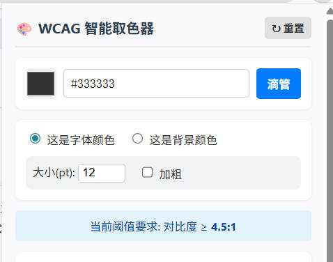
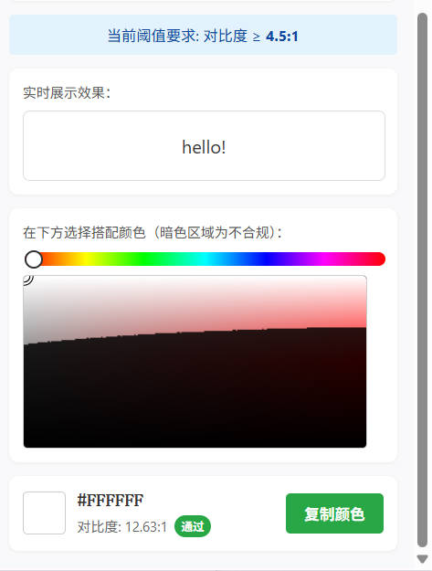

# 🎨 WCAG 智能取色器 (WCAG Smart Color Picker)

一个专为前端开发者、UI 设计师和无障碍（a11y）测试人员打造的浏览器扩展插件。它能帮助你基于 **WCAG 1.4.3 (AA)** 标准，智能选取完美的字体与背景搭配颜色。

## ✨ 核心特性

- 🧪 **原生滴管取色**：调用浏览器原生 `EyeDropper` API，轻松吸取网页任意位置的颜色。
- ⚖️ **动态 WCAG 阈值**：自动根据你设置的**字号大小**和**是否加粗**，动态切换对比度阈值（`4.5:1` 或 `3.0:1`）。
- 🚫 **智能暗化滤镜**：2D Canvas 渲染取色板，不符合无障碍标准的颜色区域会被自动“暗化”处理，合规区域一目了然。
- 🧲 **物理边界吸附算法 (Highlight!)**：取色指针**永远不会落入不合规的暗区**！无论你怎么拖动，它都会智能吸附在最近的明暗交界线上，保证你取出的颜色 **100% 合规**。
- 👀 **沉浸式实时预览**：自动对调前景色与背景色，并以你在插件中设置的真实字号/字重进行渲染，直观预览效果。
- ⚡ **轻量纯粹**：基于 Manifest V3 编写，无任何第三方框架依赖，极致秒开。

## 🛠️ 技术栈
- HTML5
- CSS3 (Flexbox & CSS Variables)
- Vanilla JavaScript (原生 JS)
- Canvas 2D API (像素级对比度计算与渲染)
- Chrome Extension API (Manifest V3, EyeDropper)

## 📸 界面截图

> 
> 
